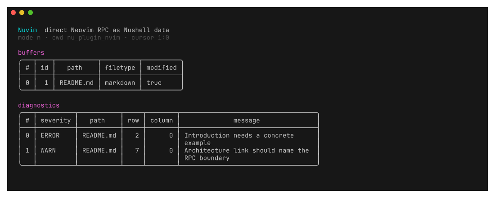

# Nuvim




Nuvim makes Neovim state available as native Nushell data.

Rows and columns are zero-based in every Nuvim command.
Columns are UTF-8 byte offsets, which matches the Neovim API.

## Architecture

The Nushell plugin connects to an existing Neovim server through MessagePack-RPC.
It uses a command-specific `--server` override first, then `$NVIM`, then Neovim's standard runtime socket directory.
Discovery probes each candidate through bounded Neovim RPC, so stale socket files never enter selection.
One live session is selected automatically. Bare `nuvim` opens Nushell's native picker when more than one editor is running.
This side cannot use `nvim-oxi` because that crate needs Neovim symbols inside the editor process.

The shared `nuvim-protocol` crate owns RPC framing, handle types, server discovery, generated API methods, and quickfix conversion.
`nuvim-codegen` reads `nvim --api-info` and generates the Rust client and API metadata used by the Nushell plugin.
See [the architecture note](docs/architecture.md) for the protocol and future session design.

## Install with Nix

Install the runtime plugin from GitHub:

```sh
nix profile install github:roshbhatia/nu_plugin_nvim#nu-plugin
```

Register the Nushell plugin:

```nu
plugin add (which nu_plugin_nuvim | get path.0)
```

Nushell loads the registered `nuvim` commands on its next start.
Use `plugin use nuvim` to reload them in an existing session.

Flake consumers can install the plugin without codegen in their runtime closure:

```nix
{
  inputs.nuvim.url = "github:roshbhatia/nu_plugin_nvim";

  outputs = { nixpkgs, nuvim, ... }: {
    # Add this package to Home Manager or the system profile.
    packages.aarch64-darwin.default =
      nuvim.packages.aarch64-darwin.nu-plugin;
  };
}
```

`packages.<system>.runtime`, `nu-plugin`, and `default` contain only `nu_plugin_nuvim`.
`packages.<system>.codegen` is the maintainer-only API generator.
Neovim needs no editor-side plugin. Start it with `--listen`, set `$NVIM`, or let Nuvim discover its socket.

This flake does not expose a default `nix run` app because a Nushell plugin binary speaks the plugin protocol rather than a user-facing terminal protocol.

Use the declared development shell for every Rust and Neovim dependency:

```sh
nix develop
cargo test --workspace
./hack/screenshots.sh
```

## Nushell commands

The version 0.1 surface is:

```text
nuvim
nuvim servers
nuvim context
nuvim cursor
nuvim cursor set <row> <column>
nuvim buffers
nuvim buffer use <id>
nuvim text [--buffer <id>] [--start <row>] [--end <row>]
nuvim selection
nuvim open [paths...]
nuvim edit <row> <column> [--end-row <row>] [--end-column <column>] [--buffer <id>]
nuvim replace [--selection] [--buffer <id>]
nuvim diagnostics
nuvim quickfix get
nuvim quickfix set [--title <text>]
nuvim quickfix open [--height <rows>]
nuvim scratch [--name <name>] [--filetype <name>]
nuvim command <ex-command>
nuvim call <method> [arguments...]
nuvim lua <code> [arguments...]
```

Every editor command accepts `--server <socket-or-host:port>`.
Without that flag, Nuvim uses `$NVIM` or automatically selects the only discovered session.
Run bare `nuvim` to choose between multiple live sessions with Nushell's native table picker.
To bind later commands to that choice, save its server address:

```nu
$env.NVIM = (nuvim | get server)
```

Use `nuvim servers` for a non-interactive list.

Neovim has no built-in human session name.
Nuvim labels each session with its current buffer, working directory, process ID, mode, and socket address.

Buffer, window, and tab records include IDs and server identity.
Raw handle results use `{type: "nvim-handle", kind, id, server}` records instead of bare integers.
Nuvim rejects a handle from another server, including handles nested in lists, records, or pipeline arguments.
Unknown MessagePack extensions and maps with non-string keys use tagged records without data loss.

`nuvim call` validates methods and argument counts against generated API metadata.
The generator reads the same `nvim --api-info` specification used to produce the typed Rust client.

## Demo

Inspect the current editor state:

```nu
nuvim context
```

Find modified buffers:

```nu
nuvim buffers
| where modified
| select id path filetype
```

Filter diagnostics:

```nu
nuvim diagnostics
| where severity == "ERROR"
| select path row column message
```

Open paths produced by another command:

```nu
git diff --name-only
| lines
| where { not ($in | is-empty) }
| nuvim open
```

Replace the last visual selection:

```nu
nuvim selection
| get text
| str uppercase
| nuvim replace --selection
```

Move the cursor and insert text at its position:

```nu
nuvim cursor set 12 4
"TODO: " | nuvim edit 12 4
nuvim text --start 12 --end 13
```

Switch to a listed buffer:

```nu
nuvim buffers
| where path =~ "README.md$"
| first
| get id
| nuvim buffer use
```

Send ripgrep matches to quickfix:

```nu
rg TODO --json
| lines
| each { $in | from json }
| where type == "match"
| each { |event|
    {
      path: $event.data.path.text
      row: ($event.data.line_number - 1)
      column: $event.data.submatches.0.start
      text: ($event.data.lines.text | str trim --right)
      type: "I"
    }
  }
| nuvim quickfix set --title "TODO"
| nuvim quickfix open
```

Raw escape hatches preserve structured values:

```nu
nuvim call nvim_get_current_buf
nuvim lua 'return vim.bo.filetype'
```

## Agent control

Nuvim exposes a small observe, navigate, edit, and operate contract for agents.
Agents should select a server explicitly, inspect state before a mutation, use
range edits instead of simulated keys, and verify the resulting buffer state.

See [the agent control contract](docs/agent-control.md) and its
[runnable recipe](recipes/agent-control) for the exact workflow.

## Quickfix schema

Quickfix input accepts partial records.
Missing positions stay unset.

```nu
{
  path: "/project/src/main.rs"
  row: 41
  column: 6
  end_row: null
  end_column: null
  text: "some diagnostic"
  type: "E"
}
```

Nuvim adds one only when it sends positions into Neovim quickfix functions.
`nuvim quickfix get` subtracts one before returning records.

## Scratch buffers

Strings become text, and string lists become lines.
Other Nushell values use Nushell's expanded structured representation.

```nu
ls | nuvim scratch --name files --filetype nuon
```

## Recipes

The [recipes directory](recipes) contains one folder per workflow.
Each folder has a runnable Nushell script and a focused README.

## Deferred work

`CustomValue` handles remain deferred until ordinary records prove the command model.
The protocol already keeps handle type, ID, and server identity separate from Nushell values.

`nuvim expose` should keep a plugin command alive and call `EngineInterface::eval_closure_with_stream()` for registered closures.
It needs a second callback channel so Neovim never waits on the command channel that must return its result.
Requests and responses should use versioned IDs, structured results, and explicit errors.

`nuvim watch buffer` should call `nvim_buf_attach` and map `nvim_buf_lines_event` notifications into a Nushell list stream.
Autocommand watches should call `rpcnotify()` on the client channel.
Signal cleanup must detach buffers and delete temporary autocmds.

## Current API sources

- [`nu-plugin 0.115.1`](https://docs.rs/nu-plugin/0.115.1/nu_plugin/)
- [Neovim API and MessagePack-RPC](https://neovim.io/doc/user/api/)
